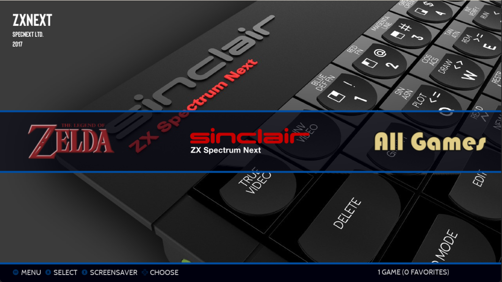
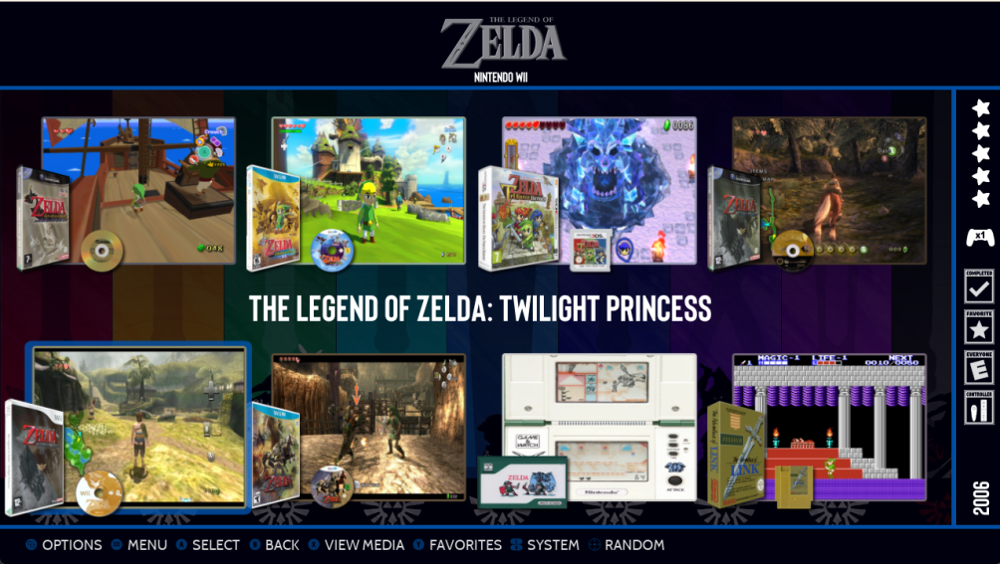
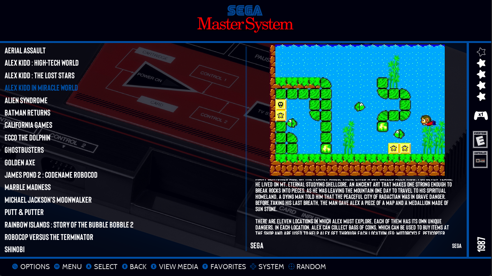
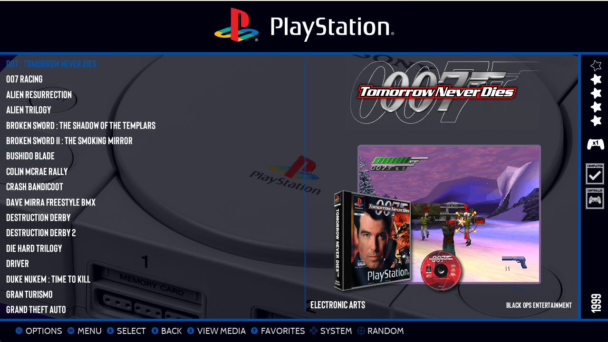

# diamond_es_de for ES-DE v2
by Weestuarty and GreatFlash

Diamond in a refined interpretion of the orginal carbon theme for emulationstation fully updated for ES-DE v2 new theme engine. It supports all systems as well as the latest application features of ES-DE.

The following options are included:

6 variants:

- Solid Logos w/grid gamelist
- Solid Logos w/text gamelist
- Solid Logos w/alternative text gamelist
- Color Logos w/grid gamelist
- Color Logos w/text gamelist
- Color Logos w/alternative text gamelist

7 color schemes:

- Blue Dark
- Yellow
- Classy
- Hyrule
- Blue Light
- Purple
- Greyscale

4 aspect ratios:

- 16:9
- 4:3
- 16:10
- 21:9

